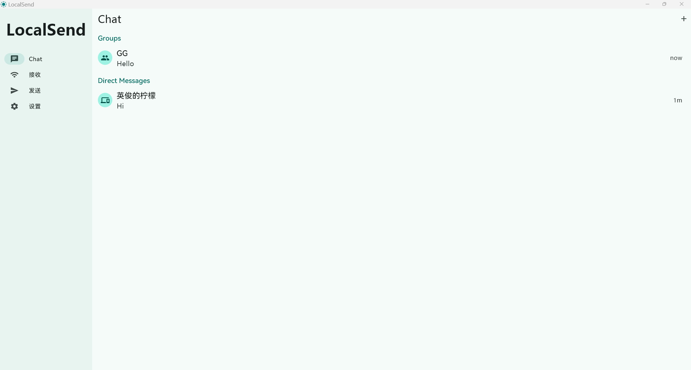
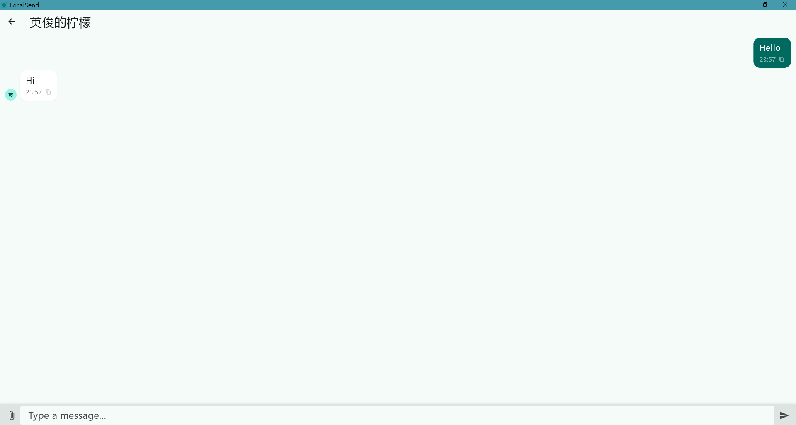
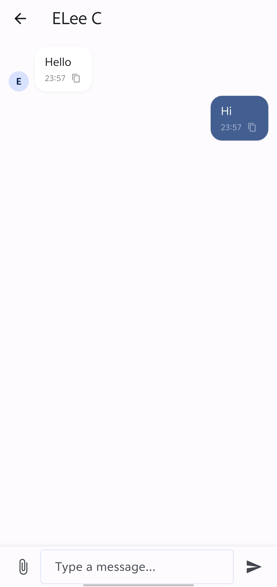
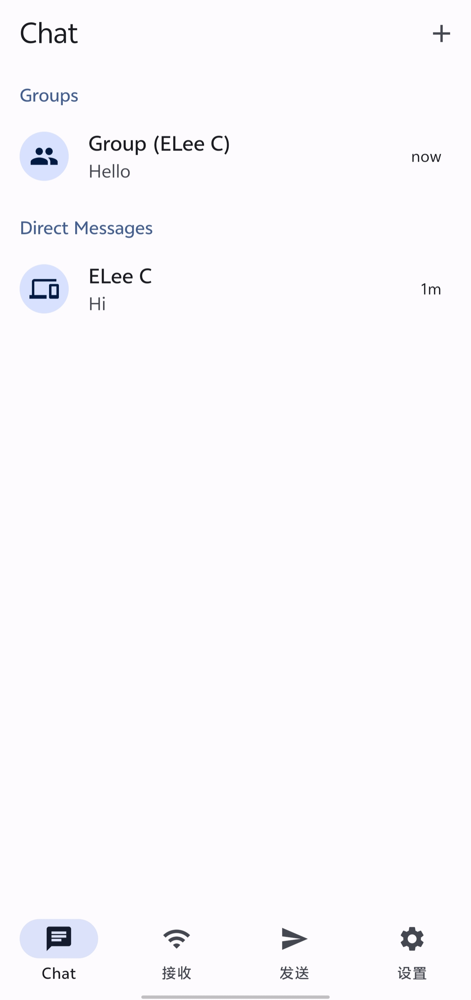

# LocalSend Chat

A LAN chat-enhanced fork of [LocalSend](https://github.com/localsend/localsend), adding full chat functionality on top of the original file transfer features.

[中文](README.md)

> Original Project: [https://github.com/localsend/localsend](https://github.com/localsend/localsend) | Website: [https://localsend.org](https://localsend.org) | License: [Apache License 2.0](LICENSE)

## Screenshots

### Windows Desktop

 

### Android

 

## Features

### Chat

- **1-on-1 Chat**: Send text messages to any device on the LAN
- **Group Chat**: Create groups, invite members, real-time sync
- **File Sharing**: Send files in chat
- **Chat History**: Persistent storage, swipe to delete conversations

### Clipboard Sharing

- Enable "Chat / Clipboard" in Settings, then copied content syncs across all connected devices (all devices must enable this setting)

## Download

| Platform | Link                                                            |
| -------- | --------------------------------------------------------------- |
| Android  | [Releases](https://github.com/EndymionLee/localsend-chat/releases) |
| Windows  | [Releases](https://github.com/EndymionLee/localsend-chat/releases) |

## License

Based on [LocalSend](https://github.com/localsend/localsend) by Tien Do Nam. Apache License 2.0. See [NOTICE](NOTICE).
